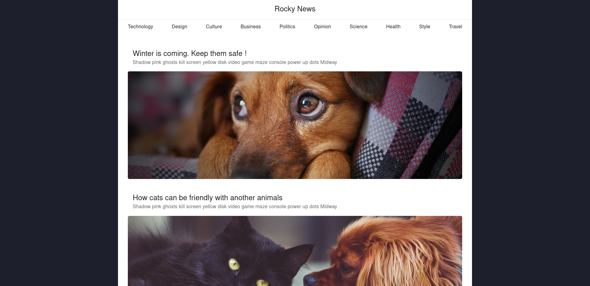

# Learning project - Rocky News

<!--  -->


# Objetivos 🎯

## Del Proyecto

- Construir una App utlizando TypeScript, React, Redux, Node.js, Express y TypeOrm.

- Conectar frontend, backend y base de datos.

- Añadir un panel para cada tipo de usuario: Administrador, Autor y patrocinador.

- Implementar medidas de seguridad tanto en el cliente como en el servidor.

- Explorar estrategias para hacer uso eficiente de los datos y requerir del menor numero de llamadas a la api.

- Practicar ajuste de estilos para distintos formatos de pantalla.

## Del Sitio

Crear una aplicación web donde se puedan encontrar diferentes tipos de noticias, con paneles de gestión dependiendo del tipo de usuario y utilizando una API propia para realizar las consultas.


# Tecnologias utilizadas 💻

Lenguaje: TypeScript  

Frontend: Vite, React, Redux, Material UI, Sweet Alert  

Backend: Node.js, Express, TypeORM, Passport, Bcrypt, Multer  

DataBase: MySQL

# Instancias

_ Actualmente se encuentra deployado y podes visitarlo aqui:
<a href="" target="_blank">Link</a>

_ Otra opción es que descargues este repositorio y sigas las  siguientes instrucciones.


## Requisitos para ejecutar localmente ⚙

### Instalacion y referencia de la base de datos

1. Instalar MySQL u otra base de datos relacional, como puede ser PostgreSQL o MariaDB.
2. Crear una base de datos con el nombre "rocky_db"
3. Dentro de ./api cree un archivo .env con sus credenciales, como se muestra a continuacion

```Javascript
PORT=puerto_api
db_type=nombre_db
db_host=dominio_db
db_name=database_name
db_port=puerto_db
db_username=user_db
db_password=password_db
saltRounds=numero_de_hashes
cookiesKey=secreto_cookies
```

Reemplazar los datos provistos con los propios
- puerto_api: NUMBER - Puerto donde se desea ejecutar la api, por ejemplo: 3001
- nombre_db: STRING - Enum que recibe el nombre de la base de datos para typeORM: Para MySQL es: "mysql", para otras bases puedes consultar la documentación.
- dominio_db: STRING - Url donde se aloja la base de datos, para local: "localhost"
- puerto_db: NUMBER -Puerto en donde se ejecuta la base de datos, para MySQL el puerto por defecto es: 3306
- database_name: STRING - El nombre de la base de datos, en este caso "rocky_db".
- user_db: STRING - Nombre del usuario de la base de datos.
- password_db: STRING - Contraseña del usuario de la base de datos.
- numero_de_hashes: NUMBER - Número de hashes para almacenar las contraseñas.
- secreto_cookies: STRING - Texto secreto para codificar/decodificar las cookies del servidor.

Para servir como ejemplo, una posible configuración:
```Javascript
PORT=3001
db_type="mysql"
db_host="localhost"
db_name="rocky_db"
db_port=3306
db_username="usuario"
db_password="contraseña"
saltRounds=10
cookiesKey="secret_cookie"
```

### Instalacion de paquetes

Utilice el administrador de paquetes de su preferencia para instalar, aqui se muestra con npm. Recuerde ejecutar este comando dentro de /client y dentro de /api

```Javascript
npm install
```

### Ejecución local
_ FrontEnd: Dentro ./client

```Javascript
npm run dev
```

_ BackEnd: Dentro de ./client

```Javascript
npm run dev
```

## A explorar noticias se ha dicho !!!

¿ Qué es lo que voy a visualizar una vez entro en el sitio ?

- Pagina Principal donde se visualizan todas las noticias
- El articulo completo para cada noticia
- Formulario de inicio de sesion y registro
- Panel de usuario dependiendo del tipo de permisos: admin, autor o sponsor